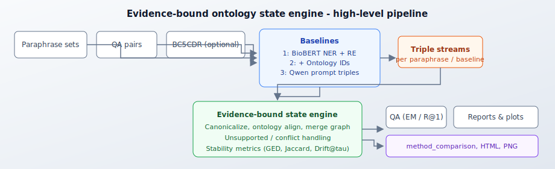
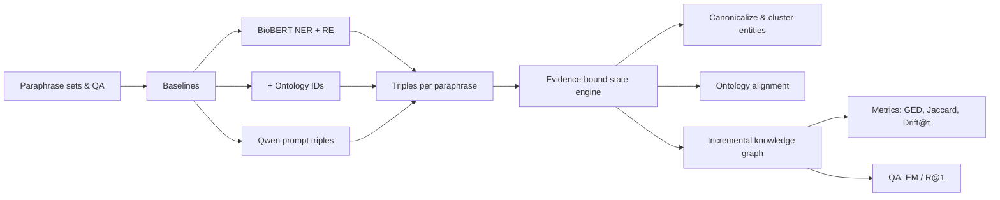
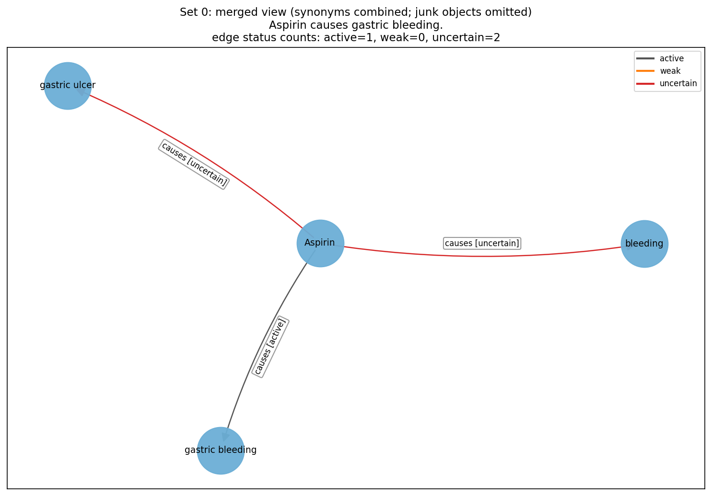

# Evidence-Bound Ontology State Engine for Biomedical Knowledge Graphs

| | |
|--|--|
| **Author** | Sindhu Pasupuleti |
| **Course / context** | Capstone — biomedical relation extraction, paraphrase stability, and QA-over-graph evaluation |

Repository layout follows common open-source practice: **baselines** and **core** code are separated, with **sample data**, **training / evaluation** entry points, and a **full end-to-end** shell driver (`run_full_pipeline.sh`).

This repository implements **neural and LLM baselines** for biomedical relation extraction under **paraphrase variation**, and a **core evidence-bound ontology state engine** that canonicalizes entities, aligns to an ontology, incrementally merges graph evidence, and reports **stability metrics** (graph edit distance, Jaccard, drift at a threshold) plus **QA-over-graph** accuracy.

---

## Quick start (minimal demo, CPU-friendly)

No GPU checkpoints required for the bundled demo JSON (uses deterministic stub extractions). From the repository root:

```bash
pip install -r requirements.txt
cd Demo && python3 run_demo.py
```

Inspect `Demo/method_comparison.md`, `Demo/state_engine_results.json`, and `Demo/state_engine_report.html`.

**Demo note (rubric):** there is no Gradio or Streamlit app; the **minimal runnable example** is this CLI demo plus the bundled files under `Demo/data/`. For a slightly larger smoke test, use `./run_full_pipeline.sh --baselines 3` (LLM-only baseline; downloads HF weights on first run).

---

## Project overview figure





---

## Repository layout

### Directory tree (high level)

```text
Capstone/
├── assets/                 # README figures (e.g. framework.svg)
├── baselines/              # Neural & LLM baselines, training, graph/QA eval
│   ├── data/               # Samples: paraphrases, QA, BC5CDR notes, scripts
│   ├── extractors/         # Qwen prompt extractor
│   ├── loaders/            # BC5CDR, MedMentions
│   ├── models/             # BioBERT NER / relation heads
│   ├── ontology/           # UMLS-style mapping helpers
│   ├── pipelines/          # Stateless & ontology-normalized pipelines
│   ├── out/                # Trained checkpoints (gitignored by default)
│   ├── train.py            # NER + relation training
│   ├── run_graph_eval.py   # Paraphrase / triple stability eval
│   ├── run_qa_eval.py      # QA-over-graph eval
│   └── run_baseline.py     # Single-sentence inference smoke test
├── Demo/                   # Minimal CPU-friendly demo + bundled JSON
│   └── data/               # paraphrase_sets_demo.json, paraphrase_results_demo.json, …
├── results/                # Sample full-run outputs + graph PNG (tracked); logs/cache ignored
├── scripts/                # Repo-root utilities (relation train JSON builder)
├── state_engine/           # Core: engine, metrics, alignment, reports
├── environment.yml         # Conda env (installs pip requirements)
├── requirements.txt
├── run_full_pipeline.sh    # End-to-end training/eval driver
└── finetune_relation_on_pipeline.py
```

**Evaluation** lives alongside the code that implements it (no separate `eval/` package): graph and paraphrase metrics in `baselines/run_graph_eval.py`, `baselines/drift_metrics.py`, `baselines/experiment_runner.py`; QA metrics in `baselines/run_qa_eval.py`, `baselines/qa_eval.py`; method comparison and tables in `state_engine/compare_to_baselines.py`, `baselines/make_results_tables.py`; visualization in `state_engine/visualize_results.py`, `baselines/graph_eval_plots.py`.

### Path reference

| Path | Role |
|------|------|
| `state_engine/` | **Core implementation:** engine, ontology alignment, embeddings/registry, relation map & clustering, metrics, aligned QA generation, comparison to baselines, visualization. |
| `baselines/` | **Baselines:** BERT NER/RE models, pipelines (stateless, ontology-normalized, Qwen), loaders (BC5CDR, MedMentions), `train.py`, graph/QA eval drivers, drift metrics, plotting. |
| `baselines/data/` | **Sample / local datasets:** paraphrase JSON, QA JSON, optional BC5CDR PubTator files, `cui_map.txt` for ontology baseline. |
| `Demo/` | **Small runnable demo** (`run_demo.py`, `finetune_relation_on_demo.py`) using bundled JSON under `Demo/data/`. |
| `scripts/` | **Utilities:** e.g. `build_relation_train.py` to build `relation_train.json` from pipeline outputs. |
| `run_full_pipeline.sh` | **End-to-end driver:** paraphrase graph eval → relation map → aligned QA → state engine → baseline QA → comparison → HTML/PNG report. |
| `finetune_relation_on_pipeline.py` | **Optional:** fine-tune the relation head on triples collected from full `paraphrase_results.json`. |
| `assets/` | **Figures** for documentation (`framework.svg` above). |
| `LICENSE` | **MIT license** for project code (see dataset-specific notices below). |

---

## Environment setup

- **Python:** 3.10+ recommended (matches typical PyTorch / Transformers stacks).
- **GPU:** Strongly recommended for `baselines/train.py`, `run_graph_eval.py` (neural baselines), and Qwen. Several scripts default to `CUDA_VISIBLE_DEVICES=13`; **override for your machine**, e.g.:

  ```bash
  export CUDA_VISIBLE_DEVICES=0
  ```

- **Install dependencies** (from repo root):

  ```bash
  pip install -r requirements.txt
  ```

  **Conda (optional):** `conda env create -f environment.yml && conda activate capstone-biomed`

  The same dependency set is mirrored under `baselines/requirements.txt`.

---

## Data preparation

### BC5CDR (training NER / relation)

1. Obtain the **BioCreative V CDR** corpus in **PubTator** form and place files under:

   `baselines/data/bc5cdr/` (see `baselines/loaders/bc5cdr_loader.py` for format).

2. If no `.txt` files are present, the loader can fetch a **small public sample** (`CDR_sample.txt`) for smoke tests (`download_bc5cdr_sample_if_missing` in `bc5cdr_loader.py`). For full experiments, use the official corpus.

3. **Citation** for BC5CDR appears in `baselines/data/bc5cdr/CDR_Data/README.txt` (NCBI public-domain notice + papers).

### Paraphrases and QA (evaluation)

- Bundled samples:
  - `baselines/data/paraphrases/paraphrase_sets_50.json`
  - `baselines/data/qa/qa_100.json`
- Demo seeds (small, for `Demo/run_demo.py`):
  - `Demo/data/paraphrase_sets_demo.json`
  - `Demo/data/paraphrase_results_demo.json`

### Optional ontology mapper (Baseline 2)

- Place or generate `baselines/data/cui_map.txt`, or rely on BC5CDR-derived mapping as described in `baselines/run_baseline.py`.

---

## Training

### NER + relation (Baselines 1 & 2)

From `baselines/`:

```bash
cd baselines
# Example: BC5CDR + BioBERT; skip NER training and use Hub pretrained NER (see train.py --help)
python3 train.py --dataset bc5cdr --model_name dmis-lab/biobert-base-cased-v1.1 --skip_ner_training
```

Checkpoints are written to `baselines/out/ner` and `baselines/out/relation` by default (**gitignored**; train or copy from your compute environment).

### Optional: fine-tune relation on pipeline extractions

From repository root (after you have `results/paraphrase_results.json` from the graph eval step):

```bash
python3 finetune_relation_on_pipeline.py \
  --paraphrase_results results/paraphrase_results.json \
  --base_rel_dir baselines/out/relation \
  --out_rel_dir baselines/out/relation_pipeline_finetuned
```

### Demo-scale relation fine-tune

```bash
cd Demo
python3 finetune_relation_on_demo.py
```

---

## Testing & evaluation

### Quick baseline smoke test

```bash
cd baselines
# Baseline 3 (Qwen) does not require local NER/RE checkpoints
python3 run_baseline.py 3 --text "Aspirin may cause gastric bleeding in some patients."
```

### Full pipeline (recommended)

Requires relation checkpoints on disk if you include neural baselines **1** and/or **2** (see script checks). To run **only** the LLM baseline:

```bash
./run_full_pipeline.sh --baselines 3
```

With trained relation model under `baselines/out/relation`:

```bash
./run_full_pipeline.sh
```

**Learned relation map (optional, between graph eval and `build_relation_map`):** after step 1 produces `results/paraphrase_results.json`, you can materialize training pairs and pass them into the shell driver:

```bash
python3 scripts/build_relation_train.py \
  --input results/paraphrase_results.json \
  --output results/relation_train.json
./run_full_pipeline.sh --relation-train results/relation_train.json
```

**Outputs** (under `results/`, recreated each run):

- `paraphrase_results.json` — per-set triples for each baseline  
- `relation_train.json` — optional; build with `python3 scripts/build_relation_train.py` if you want a non-empty learned relation map before step 2  
- `relation_map.json`, `qa_aligned_100.json`  
- `state_engine_results.json`, `state_engine_results.md`  
- `qa_results.json` — baseline QA on the same questions  
- `method_comparison.md`, `method_comparison.csv`  
- `state_engine_report.html`, `state_engine_graph_set0.png`  

### Demo pipeline (small bundled JSON)

```bash
cd Demo
python3 run_demo.py
```

### Individual eval entry points

- Graph + paraphrase metrics: `baselines/run_graph_eval.py`  
- QA eval: `baselines/run_qa_eval.py`, `baselines/qa_eval.py`  
- Drift / graph similarity: `baselines/drift_metrics.py`, `baselines/experiment_runner.py`  
- State engine CLI: `python3 -m state_engine.run_state_engine --help`  

### Default hyperparameters (reference)

| Component | Setting | Notes |
|-----------|---------|--------|
| `baselines/train.py` | `--rel_epochs 5`, `--ner_epochs 20`, `--ner_lr 3e-5`, `--ner_batch_size 16`; use `--model_name dmis-lab/biobert-base-cased-v1.1` for BioBERT | Run `python3 train.py --help` for CRF, label modes, and NER weights. |
| `baselines/run_graph_eval.py` | `--seed 42`, `--baselines 1,2,3`, `--qwen_model Qwen/Qwen2.5-0.5B` | Paraphrase JSON via `--paraphrases_file` / `--output`. |
| `finetune_relation_on_pipeline.py` | `--epochs 2`, `--batch_size 16`, `--lr 2e-5`, `--dev_ratio 0.2` | Continues from `--base_rel_dir`. |
| `run_full_pipeline.sh` | Default paraphrases `baselines/data/paraphrases/paraphrase_sets_50.json`, `--qa-count 100` | `./run_full_pipeline.sh --help` |

### Inference on new text or new paraphrase files

- **Single-sentence check:** `cd baselines && python3 run_baseline.py 1 --text "Your sentence."` (or `2` / `3`).
- **Custom paraphrase JSON** (same shape as `baselines/data/paraphrases/paraphrase_sets_50.json`):

```bash
cd baselines
python3 run_graph_eval.py \
  --paraphrases_file /path/to/your_paraphrases.json \
  --output ../results/paraphrase_results.json \
  --rel_dir ./out/relation \
  --baselines 1,2,3
```

- **State engine only:** see `python3 -m state_engine.run_state_engine --help` with your `paraphrase_results.json`, QA file, and `relation_map.json`.

---

## Key results (checked-in full pipeline)

The table below matches the committed run summarized in [`results/method_comparison.md`](results/method_comparison.md) and [`results/method_comparison.csv`](results/method_comparison.csv) (50 paraphrase sets, 100 QA items). **Re-run** `./run_full_pipeline.sh` or `Demo/run_demo.py` on your machine to regenerate; small numerical drift is normal across hardware and library versions.

| Method | GED mean ↓ | Jaccard mean ↑ | Drift@0.2 ↓ | QA EM ↑ | QA R@1 ↑ | Unsupported (note) | Conflict rec. |
|--------|------------|----------------|-------------|---------|----------|---------------------|---------------|
| Baseline 1 (stateless NER+RE) | 1.20 | 0.29 | 0.72 | 0.04 | 0.04 | — | — |
| Baseline 2 (+ ontology IDs) | 0.93 | 0.41 | 0.61 | 0.04 | 0.04 | — | — |
| Baseline 3 (Qwen) | 2.02 | 0.31 | 0.69 | 0.43 | 0.43 | — | — |
| Evidence-bound state engine | **0.16** | **0.87** | **0.13** | **0.65** | **0.68** | 0.91 | 174 |

*Interpretation note (from `state_engine/compare_to_baselines.py`): baseline graph metrics use raw triples per baseline; state-engine metrics use **canonicalized, oriented** triples before pairwise stability — trend comparison is meaningful; exact row-wise equality across methods is not required.*

### Results figure (sample merged graph)

Example **merged knowledge graph** for paraphrase **set 0** (*“Aspirin causes gastric bleeding.”*), from the same checked-in run. Edge colors reflect evidence status (active / uncertain / weak); see the legend in the image.



**Related artifacts** in `results/`:

- [`results/state_engine_report.html`](results/state_engine_report.html) — tabular HTML summary  
- [`results/method_comparison.md`](results/method_comparison.md) — full comparison notes + table + this figure (duplicate for convenience)

After you re-run `./run_full_pipeline.sh`, these files are overwritten locally; commit again if you want to refresh the bundled snapshot.

## Model card (pretrained checkpoints)

This project uses public Hugging Face models (BioBERT, Qwen, PubMedBERT+LoRA NER, etc.); see **References** for IDs. Fine-tuned weights from `baselines/train.py` live under `baselines/out/` (gitignored). If you publish a fine-tuned model, add a Hugging Face model card there.

---

## Citation

Adapt this BibTeX for your thesis or course submission (replace the URL with your public repo):

```bibtex
@misc{pasupuleti2026evidencebound,
  title        = {Evidence-Bound Ontology State Engine for Biomedical Knowledge Graphs},
  author       = {Pasupuleti, Sindhu},
  year         = {2026},
  url          = {https://github.com/YOUR_USERNAME/YOUR_REPO},
  note         = {Capstone project repository}
}
```

## GitHub Pages

`_config.yml` sets `theme: jekyll-theme-cayman`. After you create a **public** GitHub repository and push this project:

1. **Settings → Pages → Build and deployment:** source = **Deploy from a branch**, branch = **`main`** (or `master`), folder = **`/ (root)`**.
2. The site URL will be `https://<username>.github.io/<repo_name>/` (GitHub shows the exact URL on the Pages settings page once deployment succeeds).

Jekyll will use `README.md` as the project page when served from the repo root with the Cayman theme.

---

## References & acknowledgments

- **BC5CDR / BioCreative V CDR:** Wei et al.; Li et al.; corpus handling per [JHnlp/BioCreative-V-CDR-Corpus](https://github.com/JHnlp/BioCreative-V-CDR-Corpus) and NLM README shipped under `baselines/data/bc5cdr/CDR_Data/README.txt`.
- **BioBERT:** Lee et al.; model id `dmis-lab/biobert-base-cased-v1.1` via [Hugging Face](https://huggingface.co/dmis-lab/biobert-base-cased-v1.1).
- **Pretrained BC5CDR NER (LoRA):** `Francesco-A/BiomedNLP-PubMedBERT-base-uncased-abstract-bc5cdr-ner-LoRA-v1`.
- **Qwen:** `Qwen/Qwen2.5-0.5B` (and family) via Hugging Face for the prompt-based triple baseline.
- **Libraries:** PyTorch, Hugging Face `transformers`, `accelerate`, `peft`, `seqeval`, `pytorch-crf`, `scikit-learn`, `scipy`, `matplotlib`, `networkx`.

If this work builds on course materials (e.g. **Week 11 GitHub tutorial**), follow your instructor’s citation style for the course repo or slides.

Example of another student capstone repo structure (unrelated method; useful only as a **GitHub / Pages layout** reference): [Mechanistic Interpretability of GPT-like Models on Summarization (example)](https://github.com/i-anuragmishra/Mechanistic-Interpretability-of-GPT-like-Models-on-Summarization-Tasks-Capstone).

---

## License

Project **source code** is under the [MIT License](LICENSE). Dataset files under `baselines/data/bc5cdr/` follow **NCBI / BioCreative** terms (see `README.txt` there). Third-party **model weights** on Hugging Face remain under their respective licenses.

